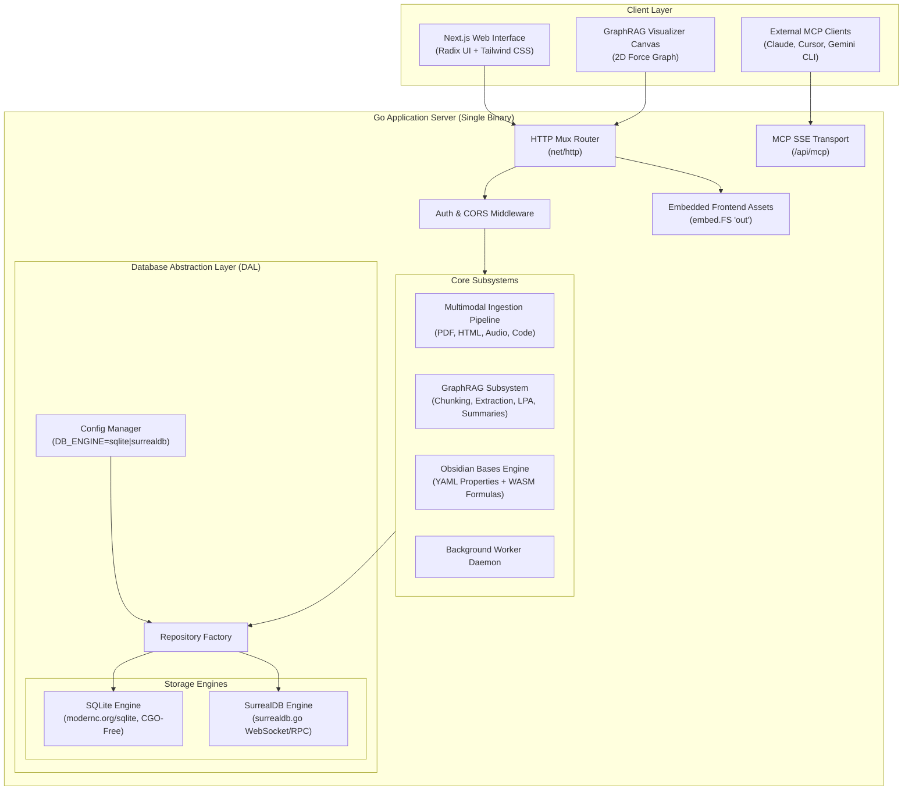
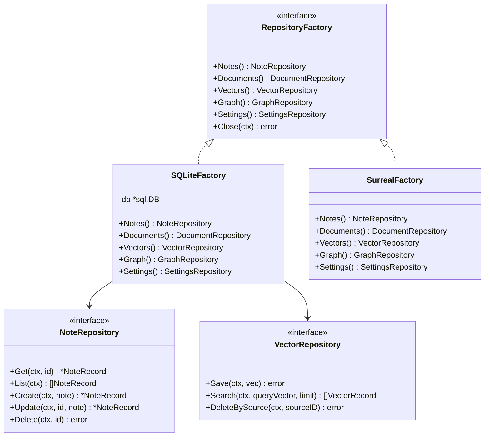
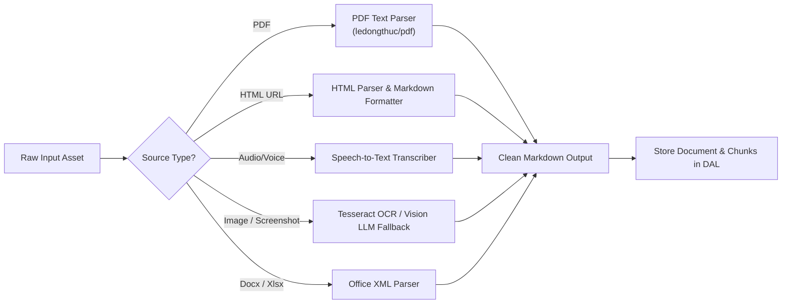
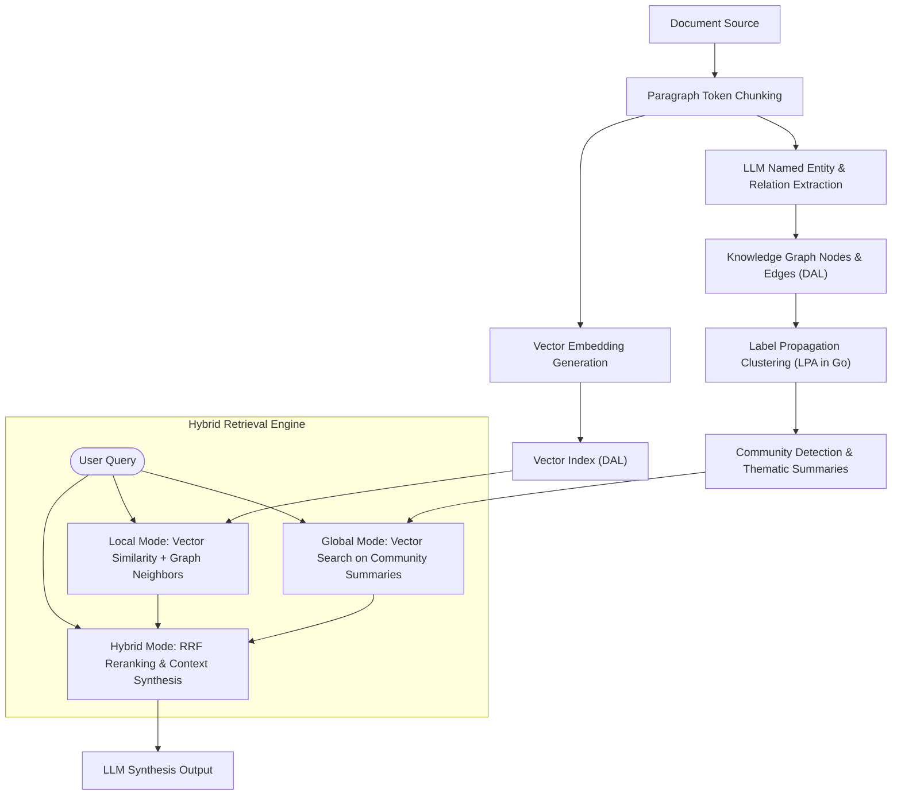
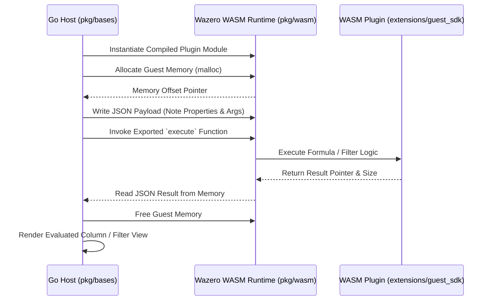
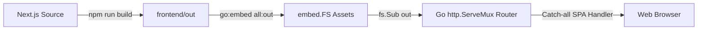

# Architecture & System Overview: Go Open Notebook

This document provides a comprehensive technical blueprint of **Go Open Notebook**, detailing system architecture, data abstraction layers, multimodal ingestion pipelines, GraphRAG indexing, WebAssembly plugin extensions, and deployment packaging.

---

## 1. System Vision & High-Level Architecture

Go Open Notebook is a high-performance, local-first personal knowledge management (PKM) and research assistant. It compiles the backend REST API, background worker daemon, and static Next.js frontend into a single zero-dependency executable.



---

## 2. Database Abstraction Layer (DAL) & Storage Engines

Go Open Notebook supports a decoupled, dual-backend database architecture configured via the `DB_ENGINE` environment variable (default: `sqlite`).



### Storage Engine Implementations

1. **SQLite (`modernc.org/sqlite`) — Default**:
   - **Characteristics**: Pure Go, zero-CGO dependency, embedded file-based (`notebook.db`).
   - **Migrations**: Executed automatically on startup via `embed.FS` (`schema/*.sql`).
   - **Vector Embeddings**: Vectors stored as JSON strings in SQLite tables; similarity search executed via in-memory/SQL cosine similarity functions.

2. **SurrealDB (`surrealdb.go`) — Multi-Model**:
   - **Characteristics**: Client-server mode connecting via WebSockets/RPC (`ws://localhost:8000/rpc`).
   - **Graph Native**: Executes SurrealQL graph traversals (`RELATE source -> reference -> notebook`).

---

## 3. Multimodal Ingestion Pipeline

The ingestion pipeline handles heterogeneous data sources (PDFs, URLs, Audio notes, images, and Obsidian vaults), transforming raw assets into cleaned Markdown content and tokenized chunks.



---

## 4. GraphRAG Subsystem (Knowledge Graph & Vector Search)

Go Open Notebook integrates a GraphRAG knowledge graph extraction, clustering, and retrieval engine.



---

## 5. Obsidian Bases & WASM Extension System

To provide dynamic database-like views over Markdown frontmatter properties without native code execution security risks, Go Open Notebook integrates a WebAssembly (WASM) plugin extension system.



---

## 6. External Connectivity & Model Context Protocol (MCP)

External AI coding assistants (such as Claude Code, Cursor, or Gemini CLI) can connect directly to Go Open Notebook using the **Model Context Protocol (MCP)** endpoint:

- **SSE Transport Endpoint**: `GET /api/mcp/sse`
- **JSON-RPC Message Endpoint**: `POST /api/mcp/message`
- **Exposed Tools**:
  - `search_graph`: Executes hybrid vector/graph queries against a notebook.
  - `get_entity_connections`: Returns 1st-degree topological neighbor nodes for an entity.
  - `get_community_summary`: Returns pre-computed thematic community outlines.

---

## 7. Embedded Web Frontend & Production Build

The Next.js 15 frontend application is compiled as a static single-page application (`npm run build`, `output: 'export'`) into `frontend/out`.



To compile the self-contained production binary:
```bash
cd frontend && npm run build && cd ..
go build -o open-notebook ./cmd/server
```

---

## 8. Directory & Package Structure

```
go-notebook/
├── cmd/
│   ├── engine/          # CLI tool for Obsidian Bases WASM engine
│   └── server/          # Main unified application entrypoint
├── conductor/           # Conductor spec-driven development tracks & context
├── docs/                # Architecture & design documentation
├── extensions/          # WASM guest SDK and example plugin source files
├── frontend/            # Next.js 15 frontend application
│   ├── frontend.go      # embed.FS wrapper declaration for 'out'
│   └── out/             # Compiled static web assets
├── internal/
│   ├── ai/              # Provider clients (OpenAI, Anthropic, Gemini, Ollama)
│   ├── api/             # HTTP router, middleware, and MCP endpoints
│   ├── db/              # Database configuration and storage implementations
│   │   ├── factory/     # Dynamic repository factory loader
│   │   ├── repository/  # Domain repository interfaces
│   │   ├── sqlite/      # SQLite modernc driver & embedded migrations
│   │   └── surrealdb/   # SurrealDB driver adapter
│   ├── domain/          # Core domain models (Notebook, Source, Note, RAGGraph)
│   ├── extractor/       # Document & audio parsing pipeline
│   ├── graphrag/        # Chunking, entity extraction, LPA, and retrieval
│   └── worker/          # Background task execution daemon
├── pkg/
│   ├── bases/           # Obsidian Bases engine & view evaluator
│   ├── okf/             # Open Knowledge Format parser & graph indexer
│   └── wasm/            # Wazero WebAssembly host runtime manager
├── .env                 # Environment configuration template
├── go.mod               # Go module definition
└── README.md            # Project overview & getting started guide
```
