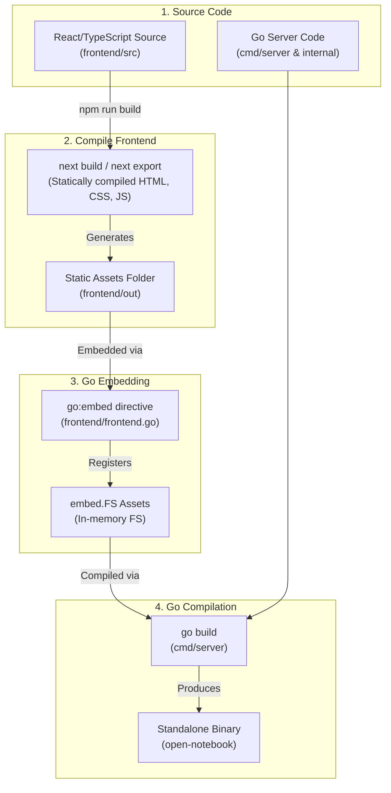
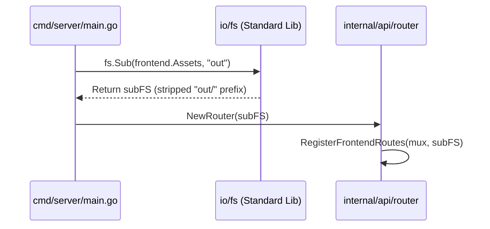
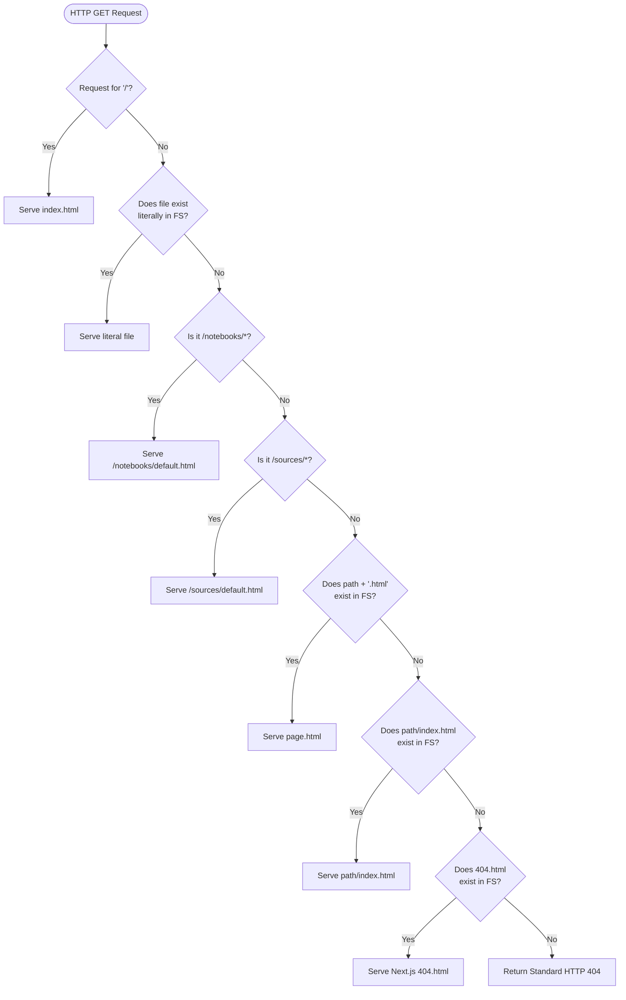

# Design & Architecture: Embedded Web Frontend

This document describes how the Next.js web application is built, compiled, embedded, and served directly from the unified Go executable.

---

## 1. System Overview & Data Flow

Go Open Notebook is designed to run as a single, self-contained, zero-dependency executable. Instead of requiring users to manage separate frontend web servers or static asset directories, the entire Next.js-compiled single-page application (SPA) is baked directly into the Go binary at compile time.

### Build & Embed Pipeline



---

## 2. Compile-Time Configuration

### Next.js Static Export Configuration
To support embedding, the frontend must be compiled as a static export (no dynamic Node.js server dependencies). This is configured in [next.config.ts](file:///home/innomon/orez/apps/go-notebook/frontend/next.config.ts) using the `output: 'export'` option:

```typescript
import type { NextConfig } from "next";

const nextConfig: NextConfig = {
  output: 'export', // Tells Next.js to produce a static HTML/CSS/JS export
  distDir: 'out',   // Directory where the build files will be saved
  images: {
    unoptimized: true, // Required for static exports
  },
};

export default nextConfig;
```

### Go Embedding Declaration
The embedding occurs in [frontend/frontend.go](file:///home/innomon/orez/apps/go-notebook/frontend/frontend.go), which uses the standard library `embed` package:

```go
package frontend

import "embed"

// Assets contains the statically compiled Next.js frontend pages and resources
//
//go:embed all:out
var Assets embed.FS
```

> [!NOTE]
> The prefix `all:` is important here (i.e. `all:out`). It instructs Go to also embed files starting with dot prefixes (`.`), such as Next.js dotfile assets, which are normally ignored by standard embed globs.

---

## 3. Server Startup and Mount

During application initialization in [cmd/server/main.go](file:///home/innomon/orez/apps/go-notebook/cmd/server/main.go), the embedded filesystem is retrieved and the `out/` sub-filesystem prefix is extracted:



```go
// Extract frontend sub-filesystem (strips the 'out' prefix for clean routing)
subFS, err := fs.Sub(frontend.Assets, "out")
if err != nil {
    log.Fatalf("[API] Critical: Failed to load embedded frontend: %v", err)
}

// Pass filesystem to setup ServeMux Router
r := router.NewRouter(subFS)
```

---

## 4. SPA Catch-All & Fallback Routing

Serving statically exported files in a Single-Page App (SPA) requires dynamic path fallback mechanisms. When a user requests a URL like `/notebooks/123` or `/settings`, the web browser expects the routing to be handled client-side. The Go backend must serve the corresponding `.html` file or route fallback rather than returning a `404 Not Found`.

This is implemented robustly inside [internal/api/router/frontend.go](file:///home/innomon/orez/apps/go-notebook/internal/api/router/frontend.go):



### Handler Code Detail
```go
// RegisterFrontendRoutes binds frontend static asset routes to the ServeMux
func RegisterFrontendRoutes(mux *http.ServeMux, frontendFS fs.FS) {
	mux.HandleFunc("GET /config", handleFrontendConfig)

	fileServer := http.FileServer(http.FS(frontendFS))

	mux.HandleFunc("GET /", func(w http.ResponseWriter, r *http.Request) {
		path := r.URL.Path
		cleaned := strings.TrimPrefix(path, "/")

		// 1. Root index
		if cleaned == "" {
			fileServer.ServeHTTP(w, r)
			return
		}

		// 2. Exact file exists
		if fileExists(frontendFS, cleaned) {
			fileServer.ServeHTTP(w, r)
			return
		}

		// 3. Dynamic RAG notebooks routing fallback
		if strings.HasPrefix(path, "/notebooks/") && !hasFileExtension(path) {
			r.URL.Path = "/notebooks/default.html"
			fileServer.ServeHTTP(w, r)
			return
		}

		// 4. Dynamic RAG sources routing fallback
		if strings.HasPrefix(path, "/sources/") && !hasFileExtension(path) {
			r.URL.Path = "/sources/default.html"
			fileServer.ServeHTTP(w, r)
			return
		}

		// 5. Appending ".html" (e.g., /settings -> /settings.html)
		if fileExists(frontendFS, cleaned+".html") {
			r.URL.Path = path + ".html"
			fileServer.ServeHTTP(w, r)
			return
		}

		// 6. Subdirectory index (e.g., /settings/api-keys -> /settings/api-keys/index.html)
		if !hasFileExtension(path) && fileExists(frontendFS, filepath.Join(cleaned, "index.html")) {
			r.URL.Path = filepath.Join(path, "index.html")
			fileServer.ServeHTTP(w, r)
			return
		}

		// 7. Render Next.js compiled 404 page
		if fileExists(frontendFS, "404.html") {
			r.URL.Path = "/404.html"
			fileServer.ServeHTTP(w, r)
			return
		}

		// 8. Standard fallback
		http.NotFound(w, r)
	})
}
```

---

## 5. Development vs. Production Workflows

To maintain quick iteration loops, developers can choose between two modes of operation:

### Option A: Local Dev Mode (Hot-Reloading)
During UI development, rebuilding static files and restarting the Go binary on every line change is slow. Run both servers concurrently:

1. **Start Go Backend (Port 5055)**:
   ```bash
   go run ./cmd/server
   ```
2. **Start Next.js Frontend Dev Server (Port 3000)**:
   ```bash
   cd frontend
   npm run dev
   ```
Next.js acts as the local development proxy. Any API request directed to `http://localhost:3000/api/*` is automatically forwarded to the Go backend on `http://localhost:5055` based on the proxy settings.

### Option B: Standalone Production Build
To package a single self-contained binary file:

1. **Export the static frontend assets**:
   ```bash
   cd frontend
   npm run build
   cd ..
   ```
2. **Compile Go standalone binary**:
   ```bash
   go build -o open-notebook ./cmd/server
   ```
This generates the zero-dependency executable `open-notebook`, ready for production deployment.
