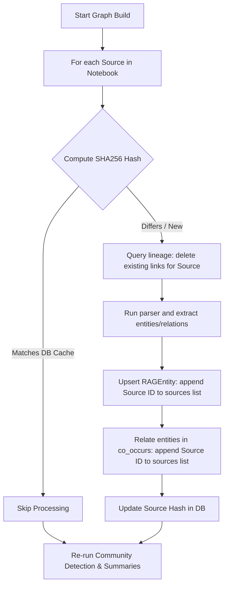
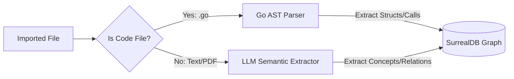

# GraphRAG Improvements Proposal
*Inspired by [safishamsi/graphify](https://github.com/safishamsi/graphify)*

This document outlines a plan to align our **Go + SurrealDB + Next.js** GraphRAG implementation with the features and optimizations of **Graphify**, a state-of-the-art Python-based codebase mapping skill.

---

## 📊 Core Architecture Comparison

| Feature | Graphify (Python) | Our Go-Notebook GraphRAG (Current) | Proposed Go Framework Alignment |
| :--- | :--- | :--- | :--- |
| **Extraction Engine** | Tree-sitter (AST for Code) + Whisper (Audio/Video) + Vision/LLM (Docs & Images) | Simple regex paragraph parsing + 100% LLM extraction for all text | **Hybrid Parser**: Go native AST parser for source code files, text parser for others, skipping LLMs for code structure. |
| **Incremental Updates** | SHA256 caching layer; rebuilds/extracts only modified files | Clears the entire notebook graph and rebuilds everything from scratch | **Stateful Hashing in SurrealDB**: Track source-node-edge lineages to delete only modified source subsets during builds. |
| **Community Detection** | Leiden algorithm (Modularity optimization based on edge topology) | Label Propagation Algorithm (LPA) in pure Go | **Weighted Louvain/Leiden in Go**: Port an optimized modularity clustering algorithm to Go to create stable thematic clusters. |
| **Graph Analysis** | Graph-wide structural analysis (`analyze.py`) finding "god nodes" and "surprising connections" | Graph database nodes saved in database but no meta-analysis performed | **SurrealDB Aggregations**: Query node degrees and cross-community bridge edges, presenting insights on a dashboard. |
| **Offline Vault Export** | Exports as standard interactive `graph.html`, SVG, and Obsidian Vault | Exposes REST API endpoint `/api/notebooks/{id}/graph` for dynamic UI | **Obsidian Vault Exporter**: Export notebook sources and entities as a zipped Obsidian folder with standard backlinks. |
| **External Agent Access** | Stdio-based Model Context Protocol (MCP) Server | Closed REST APIs for internal Web App | **MCP Server Endpoint**: Exposed an SSE-based MCP endpoint at `/api/mcp` using the `modelcontextprotocol/go-sdk` design pattern. *(COMPLETED)* |

---

## 🛠️ Detailed Improvements & Implementation Plan

### 1. Stateful Incremental Graph Building (Hashing & Lineage Tracking)
> [!IMPORTANT]
> Currently, rebuilding the GraphRAG index deletes all entities, relations, and communities for the entire notebook and re-processes all sources. This is extremely slow and expensive.

#### The Proposal
We can introduce a stateful hashing and lineage tracking system directly in our **SurrealDB** schema. By tracking which source document generated which `RAGEntity` and `co_occurs` relationship, we can incrementally update the graph when a single source is added, edited, or deleted.



#### SurrealDB Schema Adjustments
We update the entity and relationship schemas to track `sources` instead of simple counts and weights. The count and weight will be derived from the size of the sources array.

```surrealql
-- RAGEntity schema tracking source lineage
DEFINE TABLE RAGEntity SCHEMAFULL;
DEFINE FIELD name ON TABLE RAGEntity TYPE string;
DEFINE FIELD notebook ON TABLE RAGEntity TYPE record<notebook>;
DEFINE FIELD sources ON TABLE RAGEntity TYPE array<record<source>>;
DEFINE INDEX idx_entity_name ON TABLE RAGEntity COLUMNS notebook, name UNIQUE;

-- co_occurs (relation table) tracking source lineage
DEFINE TABLE co_occurs SCHEMAFULL;
DEFINE FIELD notebook ON TABLE co_occurs TYPE record<notebook>;
DEFINE FIELD sources ON TABLE co_occurs TYPE array<record<source>>;
```

#### Go Implementation
Instead of simple increments, our `domain.CreateOrUpdateEntity` and `RelateEntities` functions will append the source ID to the arrays, and clean up when sources are removed:

```go
// RelateEntities appends sourceID to the relation edge sources list
func RelateEntities(ctx context.Context, notebookID string, sourceID string, entA, entB *domain.RAGEntity) error {
	fromID := entA.ID.String()
	toID := entB.ID.String()
	if entA.Name > entB.Name {
		fromID, toID = toID, fromID
	}

	query := `
		LET $existing = (SELECT id, sources FROM co_occurs WHERE in = $from AND out = $to)[0];
		IF $existing.id != NONE {
			UPDATE $existing.id SET 
				sources = array::distinct(array::add($existing.sources, $source)),
				weight = count(array::distinct(array::add($existing.sources, $source)));
		} ELSE {
			RELATE $from->co_occurs->$to CONTENT {
				sources: [$source],
				weight: 1,
				notebook: $nb
			};
		};
	`
	// ... executes SurrealQL query
}
```

---

### 2. Multi-Pass Hybrid Extraction (Deterministic AST Parsing + Semantic LLM)
> [!TIP]
> Graphify parses source files locally using AST parsers before making any LLM calls. This is 100% accurate for code structure, has zero token cost, and runs in milliseconds.

#### The Proposal
If a user imports files containing source code (e.g., `.go` files), we should skip LLM extraction for the structural nodes (functions, structs, interfaces, imports, calls). We can leverage Go’s native standard library packages ([go/ast](file:///usr/share/go/src/go/ast) and [go/parser](file:///usr/share/go/src/go/parser)) to build these relationships deterministically.



#### Deterministic Go File Parser Example
We can create a code parser in our extractor package to map structs, interfaces, and function calls:

```go
package extractor

import (
	"go/ast"
	"go/parser"
	"go/token"
)

type CodeRelation struct {
	Source     string
	Target     string
	Relation   string // "calls", "implements", "imports", "defines"
}

func ParseGoCode(filePath string) ([]CodeRelation, error) {
	fset := token.NewFileSet()
	node, err := parser.ParseFile(fset, filePath, nil, parser.ParseComments)
	if err != nil {
		return nil, err
	}

	var relations []CodeRelation

	ast.Inspect(node, func(n ast.Node) bool {
		// Identify Struct declarations
		if typeSpec, ok := n.(*ast.TypeSpec); ok {
			if _, ok := typeSpec.Type.(*ast.StructType); ok {
				relations = append(relations, CodeRelation{
					Source:   node.Name.Name,
					Target:   typeSpec.Name.Name,
					Relation: "defines_struct",
				})
			}
		}
		// Identify Function calls
		if call, ok := n.(*ast.CallExpr); ok {
			if ident, ok := call.Fun.(*ast.Ident); ok {
				relations = append(relations, CodeRelation{
					Source:   node.Name.Name,
					Target:   ident.Name,
					Relation: "calls_function",
				})
			}
		}
		return true
	})

	return relations, nil
}
```

---

### 3. Graph Analysis & Insights Dashboard
> [!NOTE]
> Graphify processes the graph structure to identify "god nodes" (critical structural elements) and "surprises" (cross-community interactions), creating a readable `GRAPH_REPORT.md`.

#### The Proposal
We can bring these insights directly into the Next.js frontend by introducing a **"Graph Insights" panel** that uses SurrealDB query aggregates to find key topological structures:
1. **Central Hubs (God Nodes)**: Entities with high degree centrality (connected to many other nodes).
2. **Bridge Nodes (Surprises)**: Nodes that connect otherwise separate communities (high betweenness proxies).
3. **Generated Questions**: AI-generated prompts based on the bridge nodes and hubs.

#### SurrealDB Analysis Queries
Finding top hub nodes is incredibly fast and native to SurrealDB:

```surrealql
-- Get top hub nodes (highest degree centrality)
SELECT name, count AS degree FROM RAGEntity 
WHERE notebook = $nb 
ORDER BY count DESC 
LIMIT 5;

-- Find bridge relationships connecting distinct communities
LET $nodes = (SELECT name, community_id FROM RAGEntity WHERE notebook = $nb);
SELECT 
    in.name AS node_a, 
    out.name AS node_b, 
    in.community_id AS community_a, 
    out.community_id AS community_b 
FROM co_occurs 
WHERE notebook = $nb 
  AND in.community_id != out.community_id
LIMIT 5;
```

We can expose this data via a new REST endpoint: `GET /api/notebooks/{id}/graph/insights`, and render it as a dashboard column alongside the network visualizer.

---

### 4. Obsidian-Compatible Vault Export
#### The Proposal
Since this is a notebook application, users value porting their notes to offline knowledge management apps. We can build an exporter that compiles a notebook's documents and knowledge graph into a standard zipped Obsidian Vault structure.

```
Zipped Export:
├── sources/
│   ├── Document_A.md        <-- contains wikilinks like [[entity_x]]
│   └── Document_B.md
├── entities/
│   ├── entity_x.md          <-- lists links back to sources, and other entities
│   └── entity_y.md
└── graph.json               <-- local graph representation
```

#### Go Implementation
We can use the `archive/zip` package in Go to construct this on the fly:
1. Write each Source as a Markdown file. Search the text for known entity names and wrap them in double brackets (`[[entity_name]]`).
2. Write each `RAGEntity` as a Markdown file detailing its type, description, and list of backlinks to sources where it is mentioned.
3. Compress and send the zip file to the client for download.

---

### 5. Model Context Protocol (MCP) Server Endpoint
#### The Proposal
Rather than locking our GraphRAG database inside our notebook app, we can implement an MCP-compliant endpoint on our Go backend. This allows developer tools (like Claude Code, Cursor, or specialized terminal agents) to use our Go Notebook knowledge graphs as context.

We can add a SSE (Server-Sent Events) HTTP route in `internal/api/router/router.go`:
- `GET /api/mcp/sse`: Establishes the MCP connection.
- `POST /api/mcp/message`: Receives JSON-RPC messages to query resources, prompts, and tools.

We can expose tools like:
1. `search_graph(query, mode)`: Run hybrid queries on a notebook's graph.
2. `get_entity_connections(entity_name)`: Fetch neighbors for an entity.
3. `get_community_summary(community_id)`: Fetch community outlines.

---

## 📅 Suggested Implementation Roadmap

1. **Phase 1: Incremental Updates (DB/Worker)**
   - Update `RAGEntity` and `co_occurs` table schemas in SurrealDB to include `sources` array trackers.
   - Refactor `internal/graphrag/pipeline.go` to compute SHA256 hashes for source files and skip unchanged files.
2. **Phase 2: Graph Insights Dashboard (API/Frontend)**
   - Create the `GET /api/notebooks/{id}/graph/insights` endpoint in Go.
   - Design a visual "Insights Summary" in Next.js displaying Central Hubs, Bridge Nodes, and Auto-suggested Queries.
3. **Phase 3: Code Parsing & Offline Export (Extractor/Features)**
   - Implement native Go code parsing for source files to skip LLM entity extraction for structural elements.
   - Create the zip exporter to generate Obsidian vaults.
4. **Phase 4: MCP Integration (COMPLETED)**
   - Exposed the HTTP SSE transport endpoints for Model Context Protocol via `/api/mcp` routes to share notebook graph data with external coding assistants.
