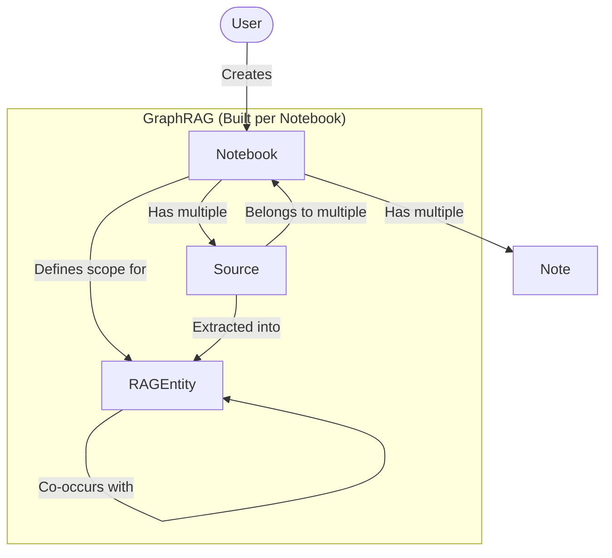

# Design Documentation: Notebook vs. Source

This document describes the distinction between **Notebooks** and **Sources** in the Go Open Notebook application, detailing their product roles, database relations, and implementations.

---

## 1. Conceptual Overview



### Notebook
A **Notebook** represents a project container, workspace, or a distinct knowledge domain. It acts as a logical boundary for organization, search queries, and GraphRAG knowledge construction. 
*   **Role**: Contextual scope. When a user asks a query or views the visualizer canvas, the scope is bounded by the active Notebook.
*   **Implementation**: Defined in [internal/domain/notebook.go](internal/domain/notebook.go#L15).

### Source
A **Source** represents a raw, imported document, media asset, or external web link. 
*   **Role**: Raw information input. Sources are processed through the ingestion pipeline (parsed, chunked, embedded, and passed to LLMs for entity extraction).
*   **Implementation**: Defined in [internal/domain/source.go](internal/domain/source.go#L22).

---

## 2. Structural & Schema Differences

The database schemas (using SurrealDB) reflect their distinct roles. Notebooks act as workspaces, while Sources contain actual content and processing metadata.

| Property | Notebook | Source |
| :--- | :--- | :--- |
| **Table** | `notebook` | `source` |
| **Primary Data** | Metadata (name, description, archive state) | Raw content (`full_text`), file/URL reference (`asset`), topics |
| **Identifier** | `notebook:unique_id` | `source:unique_id` |
| **Processing State** | None | Tracks compilation jobs via `command` reference (`command:unique_id`) and content hash |
| **Relations** | Contains links to notes and sources | Shared across notebooks via many-to-many edge relations |

### Go Struct Definition: Notebook
Defined in [internal/domain/notebook.go](internal/domain/notebook.go#L15-L22):
```go
type Notebook struct {
	ID          *models.RecordID `json:"id,omitempty"`
	Name        string           `json:"name"`
	Description string           `json:"description"`
	Archived    bool             `json:"archived"`
	Created     time.Time        `json:"created,omitempty"`
	Updated     time.Time        `json:"updated,omitempty"`
}
```

### Go Struct Definition: Source
Defined in [internal/domain/source.go](internal/domain/source.go#L22-L33):
```go
type Source struct {
	ID            *models.RecordID `json:"id,omitempty"`
	Asset         *Asset           `json:"asset,omitempty"`
	Title         string           `json:"title,omitempty"`
	Topics        []string         `json:"topics,omitempty"`
	FullText      string           `json:"full_text,omitempty"`
	Command       *models.RecordID `json:"command,omitempty"`
	Hash          string           `json:"hash,omitempty"`
	LastGraphHash string           `json:"last_graph_hash,omitempty"`
	Created       time.Time        `json:"created,omitempty"`
	Updated       time.Time        `json:"updated,omitempty"`
}
```

---

## 3. Database Relations & Edges

SurrealDB uses graph-based edges to link these entities.

1.  **Notebook <-> Source (Many-to-Many via `reference` edge)**
    *   A single Source can reside in multiple Notebooks.
    *   A Notebook holds references to many Sources.
    *   **SurrealQL Query**:
        ```sql
        RELATE source:ml_guide -> reference -> notebook:research_lab;
        ```
    *   **Retrieval**: Linked sources are fetched via the relation helper [internal/domain/source.go](internal/domain/source.go#L435).

2.  **Notebook <-> Note (One-to-Many via `artifact` edge)**
    *   Notes are generally exclusive to the Notebook they were created in.
    *   **SurrealQL Query**:
        ```sql
        RELATE note:meeting_notes -> artifact -> notebook:research_lab;
        ```

3.  **Notebook <-> GraphRAG Entities (`RAGEntity` and `co_occurs`)**
    *   `RAGEntity` holds a `notebook` RecordID field to bound its scope.
    *   `co_occurs` is a related edge between two entities, also holding a `notebook` reference.
    *   This ensures that even if two notebooks contain the same source, their graph models, cluster layouts, and summaries are built independently.
